# Instructions\_for\_TEI\_transformation\_scenario\_Mar24

**Guide to setting up and applying XML transformation scenario for manuscript records exported from CALM**

This guide explains how to:

1. Export manuscript records from CALM as XML files;
2. Set up the transformation scenario in Oxygen XML Editor to transform these files using the TEI template;
3. Apply the transformation scenario to create TEI files ready for editing.

First, download the XSL stylesheet from the ‘transcribed-manuscripts’ folder in GitHub and save this on your computer in a convenient location.

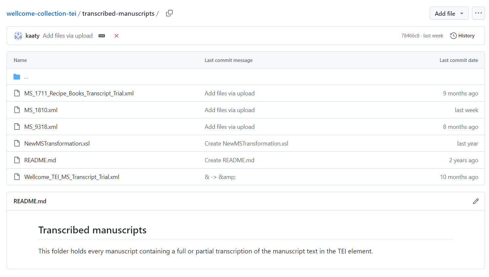

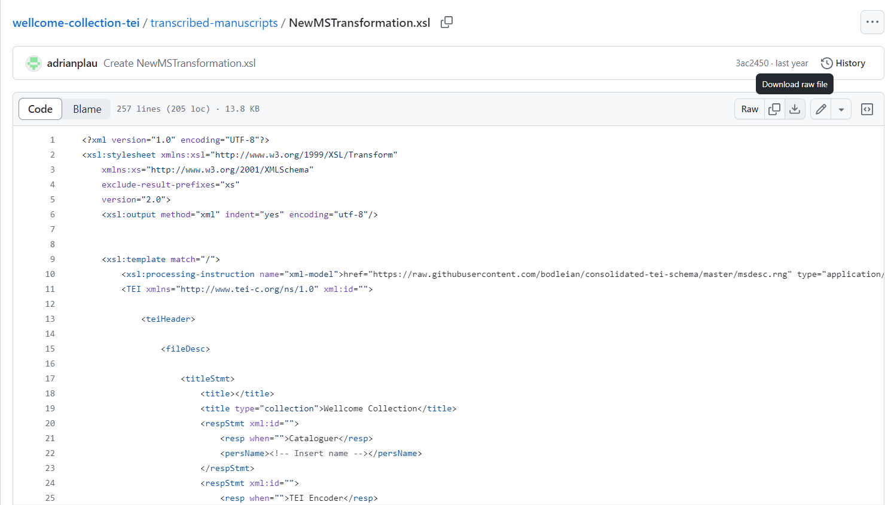

Then, export a manuscript record from CALM that you want to convert to TEI.

Open the manuscript record in CALM. Make sure you’re looking at the top (i.e. Item level) record:

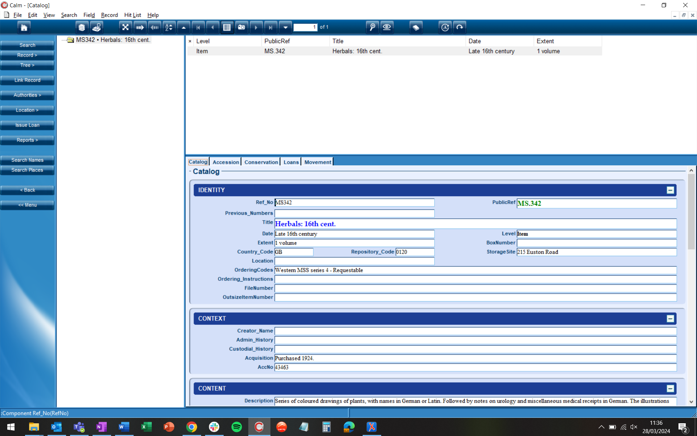

To export the record, click ‘File’ > ‘Export’. Select ‘Current record’, and ‘XML’ as the export format. Then click ‘To file…’ and choose a destination for the exported file (e.g. Downloads or Desktop). Save the file using the PublicRef as the filename and make sure XML is chosen as the file type.

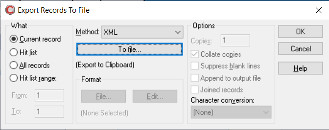

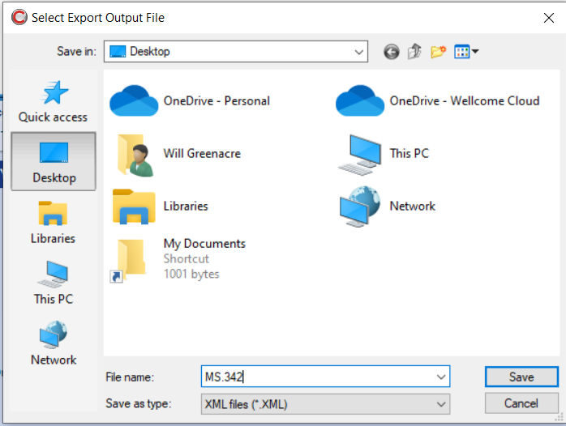

Click ‘Save’, then ‘OK’.

Note that the export produces two files, an XML document and a DTD file. Oxygen uses the XML file, but it also needs the DTD file to be in the same location for the transformation scenario to work, as the DTD file tells Oxygen where the various data elements go in the XML file.

You’re now ready to set up the transformation scenario!

In Oxygen XML Editor, click ‘File’ > ‘Open’ and select the XML document you exported from CALM. It will look something like this:

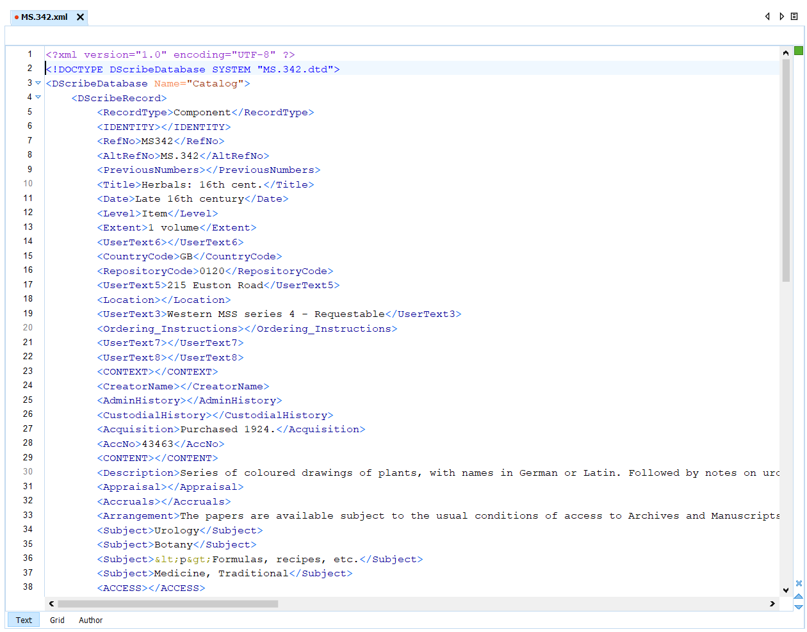

Go to ‘Document’ > ‘Transformation’ > ‘Configure Transformation Scenario’.

Click ‘New’ to create a new scenario. From the menu, select ‘XML transformation with XSLT’

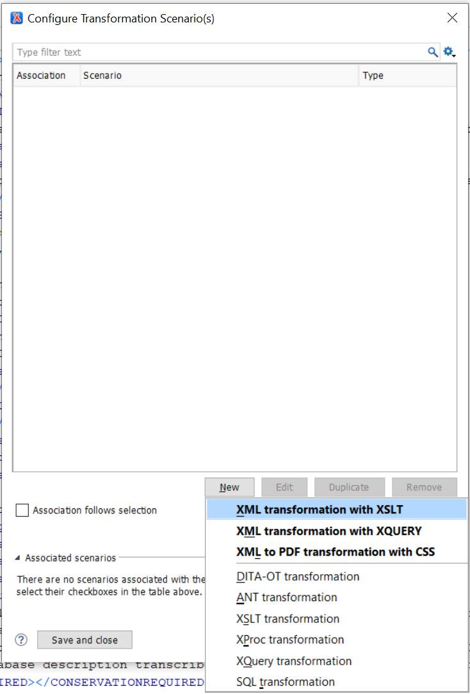

Give a name to the new scenario (e.g. ‘RecipeBookTranscriptions’).

Under the ‘XSLT’ tab, leave ‘XML URL’ as ${currentFileURL} – this will tell Oxygen to apply the transformation scenario to the currently open XML document. Next to ‘XSL URL’, click the small folder button to select the stylesheet that you downloaded from GitHub in the first step. This will transform the currently open XML document using the stylesheet.

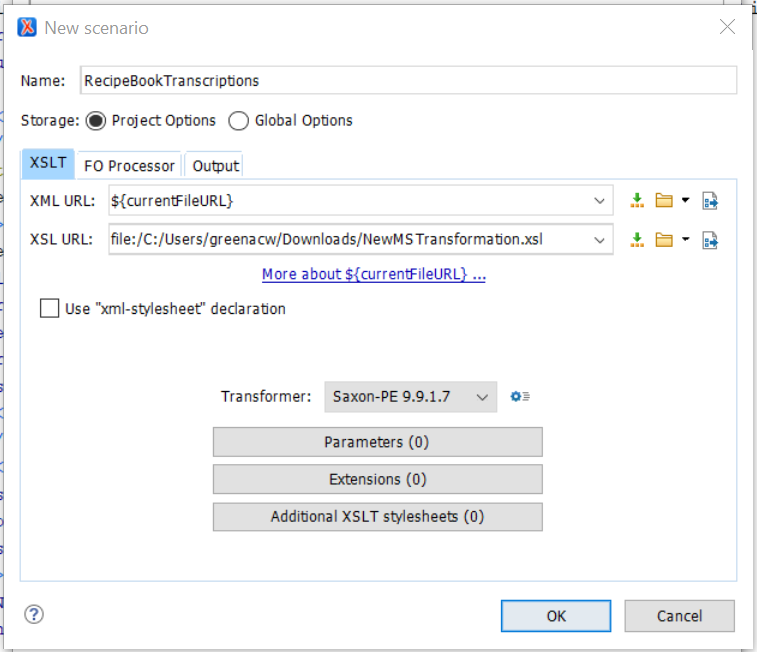

Under the ‘Output’ tab, click to select ‘Open in Editor’. This will prompt Oxygen to open the transformed file on completion so you can view and edit it. Leave the other options as they are. Then click ‘OK’.

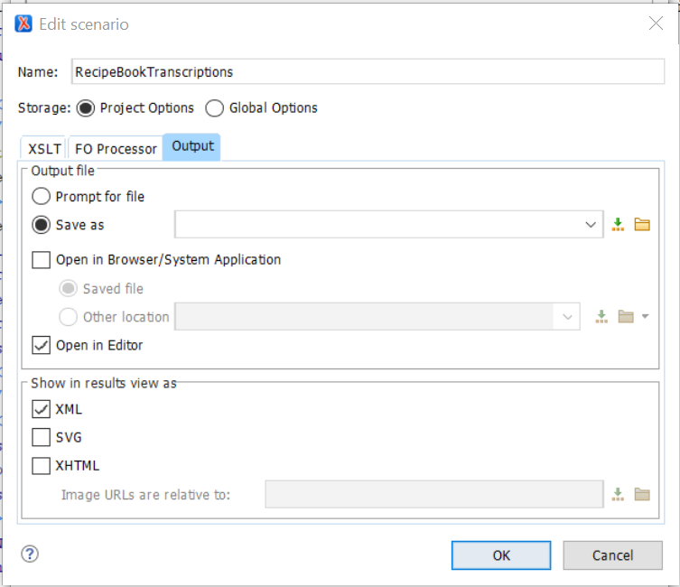

Finally, click ‘Apply associated’ to run the transformation scenario.

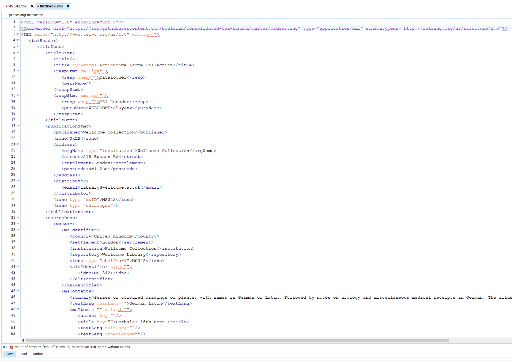

The transformed file will open in a new tab, now beautifully formatted according to our TEI template! You can now close the original (non-transformed) file in Oxygen, and click ‘File’ > ‘Save as’ to save the new file with the PublicRef as the filename and adding ‘.xml’ to save it as the correct type. If saving to the same location as the original, click ‘Yes’ when it asks you to overwrite the existing file.

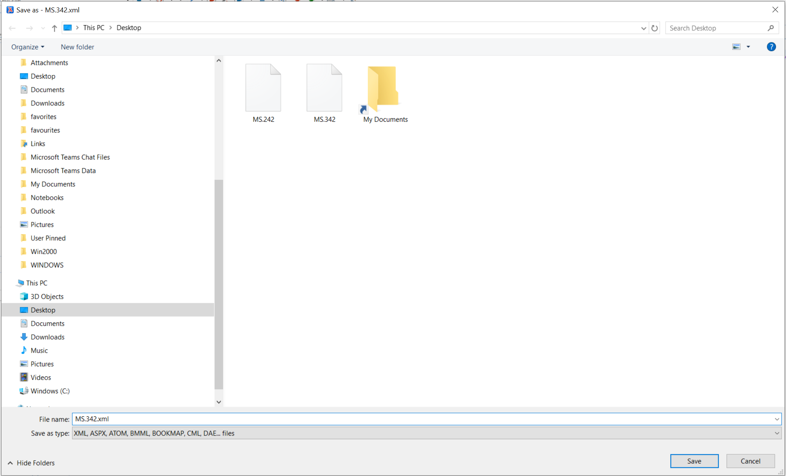

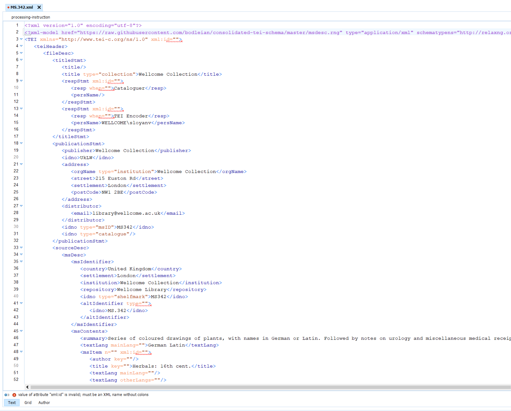

You can now start editing the transformed file, adding in the additional information as specified in the TEI template (refer to the TEI Manual for more information about this).

You only need to set up the transformation scenario once. To run it again, export another record from CALM to XML and open the XML file in Oxygen, as above.

Then, select ‘Document’ > ‘Transformation’ > ‘Apply Transformation Scenario(s)’, and select the transformation scenario you created previously. Click ‘Apply associated’ to run the scenario, then close the original and save the file as an .xml document, using the PublicRef as the filename, as above.

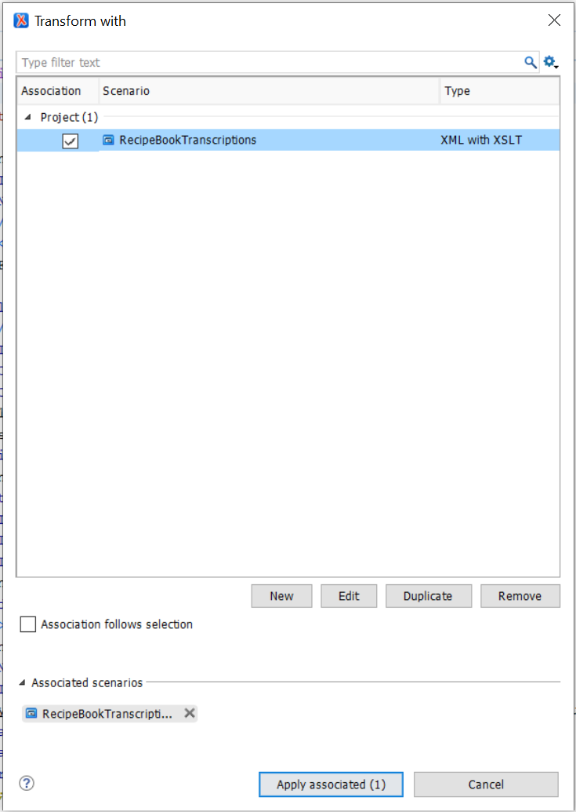

You can now enjoy many happy hours of creating and editing TEI manuscript files! 😊

Will Greenacre

March 2024
