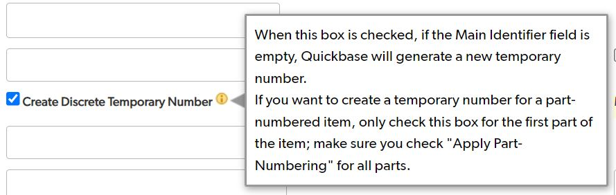
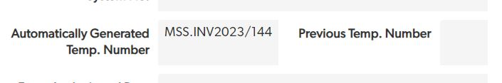

# Identifiers

**Main identifier**\
All items that are catalogued will be assigned a main identifier as its unique object number. This is usually adapted from either the title or shelfmark and follows the format overall collection \[MS], individual collection, sequential number  e.g., MS Arabic 1.

**Temporary Numbers**\
Uncatalogued items are assigned unique temporary numbers in line with archive accreditation and the other Wellcome inventories. Temporary numbers are recorded on Quickbase and are written in pencil on flags, labels or the items housing. The format for unique temporary numbers is MSS.INVYEAR/sequential number e.g., MSS.INV2022/1.

Temporary numbers are automatically generated by ticking 'Create Discrete Temporary Number'.

<figure><figcaption></figcaption></figure>

The temporary number will appear after the manuscript has been saved.

<figure><figcaption></figcaption></figure>

**Accession number**\
Any accession numbers found on manuscripts during the inventory will be recorded. These numbers are a good starting point for investigating provenance of items in our collections. We should record these numbers for catalogued and uncatalogued material and if there are multiple numbers, these should be recorded and separated by the use of a semi colon.

**Other number** \
Other numbers found during inventory for both catalogued and uncatalogued material should be recorded. This includes non-Wellcome accession numbers, lot numbers and previous identifiers. These numbers are a good starting point for investigating provenance of items in our collections. If there are multiple numbers, these should be separated by the use of a semi colon.

**System number**\
This is the Sierra b number that links an item to its Sierra record. Items imported from Sierra and TEI will have the system number field filled on import.&#x20;
